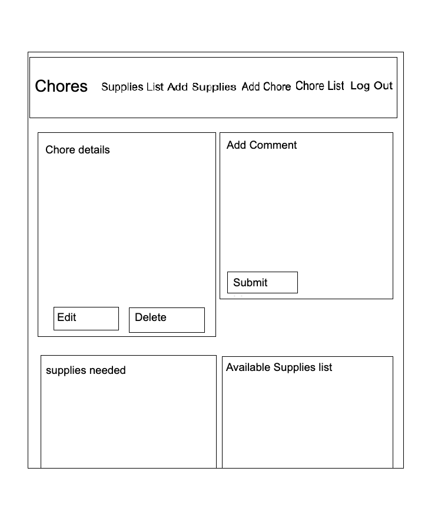

# Chore Tracker
We made this app to keep track of the various chores someone will have. It allows you to add supplies you will be using on the task. 

## Created by:

Evan Dunn

James Hubbell

Mikee Maralit

Ahmad Mahmoud

### Screenshots

### Technologies Used
- HTML
- CSS 
- Java 
- Script
- Python 
- PostGreSQL 
- Materialize

### Getting Started
https://trello.com/b/YZbyrwer/data-pirates-project-4

https://gentle-brushlands-78744.herokuapp.com/

### Next Steps
For one of our strech goals we would like to have a favorite cleanning supplies and most common chore ticker on the home page.
Another stretch goal we have is implimenting the ability to track quantities of cleaning supplies, while being able to add or subtract from the count.
